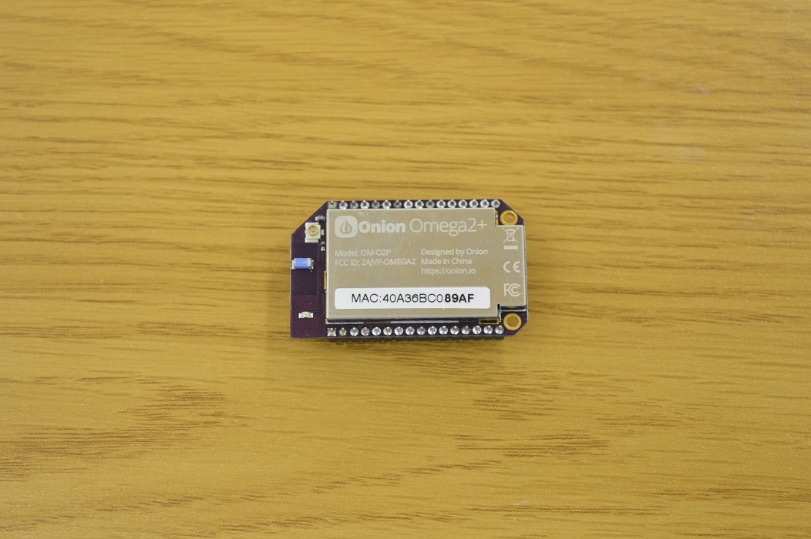
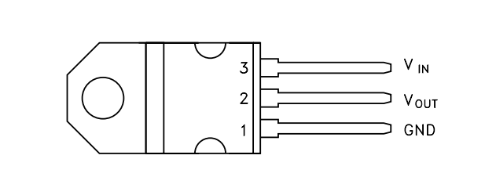
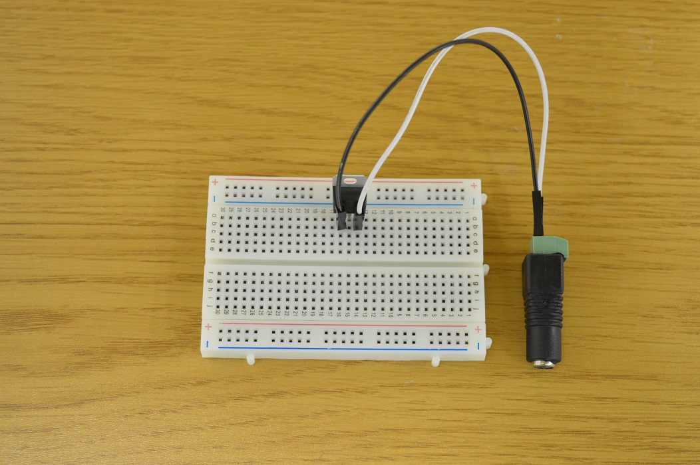
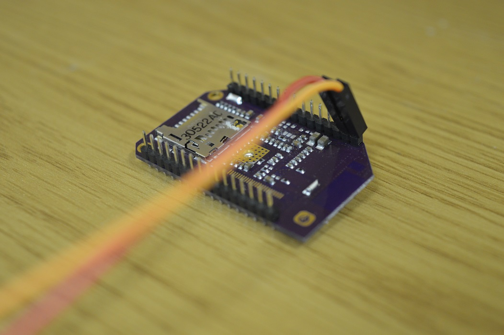

# [在没有拓展坞的情况下启动Omega](#在没有拓展坞的情况下启动Omega)

我们建议您为您的Omega提供一个拓展坞，以便从您的新设备获得最佳体验和最高性能，功能和稳定性。

然而，如果你只有一个Omega，没有Dock，这篇文章将告诉你如何使用面包板上的调节器来安全地为你的Omega供电。
> 如果你有拓展坞，那可以跳过

### [拆包](#拆包)

把Omega从包里取出

### [供电](#供电)

Omega需要由3.3V的直流电供电，而且没有Dock，我们不能使用MicroUSB提供电源。 因此，我们需要构建一个可提供宽范围输入的稳压器电路，但仍然为Omega提供所需的精确3.3V电压。

我们将需要以下设备
* 面包板
* 两条母对母的杜邦线
* 两条公对母的杜邦线
* LD1117 3.3V
* DC Barrel Jack
* DC Power Supply

> 译者注：为了更加方便的使用，建议去淘宝买块一种叫面包板供电板的东西(比起LD1117更实用)，价格也不贵，以及一块万用表。

### [连接电路](#连接电路)

电压调节器通常至少有三个支路：输入，输出和接地。 我们使用的LD1117稳压器的支路排列顺序如下图所示。 有关详细信息，请咨询您的稳压器数据手册。

拿你的LD1117，把它插入你的面包板，使每个脚都在不同的行上。

然后，您需要将您的DC连接器的接地连接到稳压器的地，将DC连接器的输出连接到稳压器输入。

准备好你的Omega

### 为Omega供电

随着你的调节器电路配置完成，你可以提供一个稳定的3.3V的电源给Omega。 取一个公对母的跳线电缆，将公插入调节器接地针脚的行中。 然后取另一个公母对母跳线电缆并将其连接到稳压器的输出支路。 这个针脚输出3.3V。

现在看看Omega的引脚图，我们将接地电缆连接到接地引脚，将3.3V电缆连接到3.3V VIN（输入）引脚。

连接上电源

#### 等待启动

Omega上的橘红色的LED应该会亮起，然后在大约10秒钟后开始闪烁。 大约一分钟后，LED将停止闪烁并保持稳定，这意味着Omega已完成其启动顺序！

有可能你的Omega的行为会有所不同：如果Omega上的橘红色的LED指示灯亮起并保持亮起，请等待约一分钟，然后你的Omega就会启动。

您的Omega的AP就可以使用了。

#### 进行初始化进程

如果这是你第一次打开Omega，你现在可以按照其余的设置步骤。 有关如何完成Omega设置的信息，请参阅使用基于浏览器的安装向导或命令行设置指南的指南。

如果选择命令行设置，您将只能通过SSH连接到Omega。 只有使用USB-UART串行转换器才可以通过串行连接。
